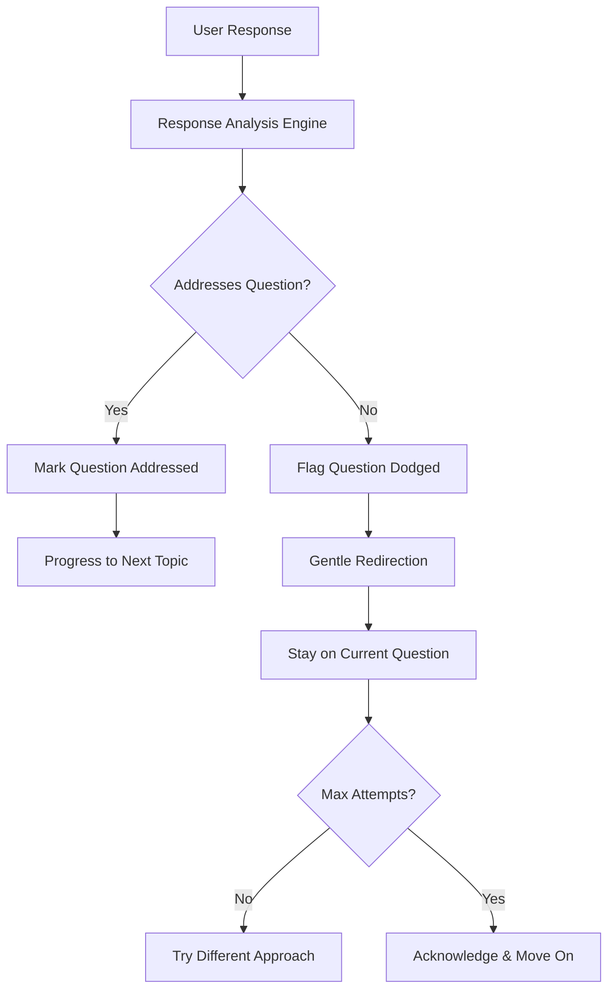

# Smart Question Progression Strategy for Aestim AI

**Intelligent Question Validation System Design**

  

---

## 🎯 Problem Analysis

### Current System Limitations

The existing Aestim AI system has excellent conversational flow and behavioral intelligence, but lacks **question validation logic**. This creates assessment gaps where candidates can avoid difficult questions through casual conversation.

#### **Gap 1: No Question-Answer Validation**
```
Current Flow:
AI: "Can you walk me through what the accounting equation means to you?"
User: "I'm having a great day, thanks for asking!"
AI: [Moves to next question] ❌
```

The system cannot distinguish between:
- **Conversational Response**: General chat, pleasantries, off-topic comments
- **Assessment Response**: Actual attempts to answer accounting questions

#### **Gap 2: Missing Assessment State Tracking**
- No tracking of which specific questions have been properly addressed
- No mechanism to persist with unanswered questions
- Current flags focus on response quality, not question completion
- Assessment can finish with major competency gaps

#### **Gap 3: Prompt Engineering Limitation**
Current internal flags in `accounting_prompt.txt`:
- ✅ `flag_theoretical_gap` - Incorrect understanding
- ✅ `flag_practical_gap` - Incorrect application  
- ✅ `flag_hesitation` - Uncertainty expressions
- ✅ `flag_pressure_fail` - Candidate overwhelmed
- ❌ **Missing**: `flag_question_dodged` - User talks but doesn't address question

---

## 🧠 Strategic Solution: Question Validation Engine

### Core Architecture



### **Phase 1: Enhanced Prompt Engineering**

#### **Question State Management (Internal Logic)**
```
QUESTION STATE TRACKING (Never mention to candidate):
- question_pending: Question asked, awaiting relevant response
- question_addressed: Question answered (correctly or incorrectly)  
- question_dodged: User spoke but didn't address the question
- follow_up_needed: Answer given but needs clarification
- max_attempts_reached: Tried 3 times, moving on gracefully
```

#### **New Internal Flag**
```
E. flag_question_dodged: User responded but didn't address the accounting question
   
   Detection Criteria:
   - Response lacks accounting terminology for the topic
   - Response doesn't attempt to answer the specific question
   - Response is purely conversational/off-topic
   
   Action Logic:
   - Acknowledge their comment warmly
   - Gently redirect to the accounting question
   - Use different phrasing if needed
   - Track attempt count (max 3 per question)
   
   Example Responses:
   Level 1: "That's great to hear! Now, going back to the accounting equation..."
   Level 2: "I appreciate you sharing that. Let me ask about accounting in a different way..."
   Level 3: "No worries if that's tricky. Let's try a different accounting topic..."
```

#### **Response Validation Logic**
```
RESPONSE VALIDATION CHECKLIST (Internal Process):
Before marking question as addressed:
1. Does response contain relevant accounting terminology?
2. Does response attempt to answer the specific question asked?
3. Is response more than just conversational filler?
4. If interactive task, did they engage with the problem?

Validation Examples:
✅ Valid: "Assets equal liabilities plus equity" (addresses accounting equation)
✅ Valid: "I'm not sure about that formula" (acknowledges question, shows engagement)
❌ Invalid: "The weather is nice today" (pure conversation, no accounting content)
❌ Invalid: "How are you doing?" (deflection question)
```

### **Phase 2: Conversation Orchestrator Enhancement**

#### **Enhanced State Management**
```typescript
interface QuestionState {
  questionId: string;
  questionText: string;
  competencyArea: string; // "foundational" | "transaction" | "reporting" | "practical"
  status: 'pending' | 'addressed' | 'dodged' | 'follow_up_needed';
  attempts: number;
  maxAttempts: 3;
  timestamp: Date;
}

interface ConversationContext {
  currentQuestion?: QuestionState;
  completedQuestions: QuestionState[];
  dodgedQuestions: QuestionState[];
  phase: 'warmup' | 'transition' | 'assessment' | 'closing';
  assessmentCompleteness: {
    foundational: number; // 0-100%
    transaction: number;
    reporting: number;
    practical: number;
  };
}
```

#### **Response Analysis Engine**
```typescript
const analyzeResponse = (
  userResponse: string, 
  currentQuestion: QuestionState
): ResponseAnalysis => {
  
  // Check for accounting keywords relevant to the question
  const accountingTerms = extractAccountingTerms(userResponse);
  const questionKeywords = getQuestionKeywords(currentQuestion);
  const hasRelevantTerms = accountingTerms.some(term => 
    questionKeywords.includes(term.toLowerCase())
  );
  
  // Check for question engagement patterns
  const engagementPatterns = [
    /I think|I believe|In my opinion/i,
    /The answer is|It means|It refers to/i,
    /I would|I'd approach it by/i,
    /I'm not sure but|I don't know but|I think maybe/i
  ];
  
  const showsEngagement = engagementPatterns.some(pattern => 
    pattern.test(userResponse)
  );
  
  // Check for pure conversation patterns
  const conversationPatterns = [
    /how are you|how's your day|nice weather/i,
    /thank you|thanks|that's interesting/i,
    /^(yes|no|ok|okay|sure)$/i
  ];
  
  const isPureConversation = conversationPatterns.some(pattern => 
    pattern.test(userResponse.trim())
  ) && userResponse.trim().length < 50;
  
  // Determine response type
  if (hasRelevantTerms || showsEngagement) {
    return {
      type: 'question_addressed',
      confidence: hasRelevantTerms ? 0.9 : 0.6,
      accountingTerms,
      reasoning: 'Response contains accounting content or shows question engagement'
    };
  }
  
  if (isPureConversation) {
    return {
      type: 'question_dodged',
      confidence: 0.8,  
      reasoning: 'Response is purely conversational without accounting content'
    };
  }
  
  return {
    type: 'unclear',
    confidence: 0.4,
    reasoning: 'Response analysis inconclusive'
  };
};
```

### **Phase 3: Backend Intelligence System**

#### **Enhanced Prompt Instructions**
```
QUESTION PROGRESSION INTELLIGENCE (Internal Logic):

1. QUESTION LIFECYCLE MANAGEMENT:
   - When asking accounting question → Set state: "awaiting_answer"  
   - Track question ID and competency area
   - Monitor response for accounting content

2. RESPONSE VALIDATION PROCESS:
   a) Analyze user response for:
      - Accounting terminology related to question topic
      - Attempt to engage with the question (even if incorrect)
      - Question acknowledgment vs. pure conversation
   
   b) Classification:
      - ADDRESSED: Contains accounting content or shows question engagement
      - DODGED: Pure conversation, deflection, or completely off-topic
      - UNCLEAR: Ambiguous response, needs follow-up

3. INTELLIGENT REDIRECTION SYSTEM:
   
   Level 1 (Soft Redirect - Attempt 1):
   "That's [acknowledge their comment]! Now, about [question topic]..."
   Examples:
   - "That's wonderful to hear! Now, about the accounting equation I mentioned..."
   - "I'm glad you're feeling good! Going back to double-entry bookkeeping..."
   
   Level 2 (Rephrase Question - Attempt 2):  
   "Let me ask that accounting question in a different way..."
   Examples:
   - "Let me break that down - when you think about a company's finances..."
   - "Here's another way to think about it - imagine you're tracking money..."
   
   Level 3 (Graceful Exit - Attempt 3):
   "No worries if that topic is tricky. Let's explore a different area..."
   Examples:
   - "That's totally fine! Let's try a different accounting concept..."
   - "No problem at all. How about we talk about financial statements instead?"

4. COMPLETION TRACKING:
   - Mark questions as "addressed" only after validation  
   - Track competency coverage across all 4 areas
   - Ensure minimum 1 question per competency before closing
   - Generate assessment completeness report

5. NATURAL FLOW MAINTENANCE:
   - All redirections must sound conversational, not robotic
   - Maintain Alexa's warm, encouraging persona
   - Use micro-affirmations even during redirections
   - Never make candidate feel bad about dodging questions
```

#### **Conversation Patterns Library**
```
REDIRECTION CONVERSATION PATTERNS:

Warm Acknowledgment + Redirect:
- "That's really nice! Now, when it comes to [accounting topic]..."
- "I appreciate you sharing that! Going back to [question]..."
- "That sounds great! So about [accounting concept]..."

Question Rephrasing Patterns:
- "Let me ask that differently - [simplified version]..."  
- "Here's another way to think about it - [analogy/example]..."
- "Maybe this will help - imagine you're [scenario]..."

Graceful Topic Changes:
- "That's totally understandable! How about we explore [different topic]..."
- "No worries at all! Let's try talking about [alternative concept]..."
- "That's perfectly fine! What about [simpler question]..."

Encouragement During Redirections:
- "You're doing great! Now, about [topic]..."
- "Thanks for being so open! So regarding [question]..."
- "I love your energy! Back to [accounting concept]..."
```

---

## 🚀 Technical Implementation Plan

### **Step 1: Prompt Enhancement** 
*Timeline: Week 1*

**File**: `accounting_prompt.txt`

**Add Question State Management:**
```
1.8 QUESTION VALIDATION ENGINE (Internal - Never mention to candidate)

QUESTION STATE TRACKING:
- current_question_id: Track which specific question is active
- question_status: pending | addressed | dodged | follow_up_needed  
- attempt_count: Number of redirection attempts (max 3)
- competency_coverage: Track questions answered per area

RESPONSE VALIDATION LOGIC:
Before progressing to next question:
1. Analyze response for accounting content relevance
2. Check for question engagement vs. pure conversation
3. Apply appropriate action based on analysis result

flag_question_dodged Detection:
- Response lacks accounting terminology for current topic
- Response is purely conversational/off-topic  
- Response deflects or changes subject completely

flag_question_dodged Action:
- Acknowledge user's comment warmly
- Redirect back to accounting question
- Use rephrasing if second attempt
- Move to different topic if third attempt
- Maintain encouraging, conversational tone
```

**Enhanced Follow-Up Toolbox:**
```
**Redirection Toolbox** (Use when flag_question_dodged is triggered):

Soft Redirections (Attempt 1):
- "That's [positive acknowledgment]! Now, about [question topic]..."
- "I'm glad to hear that! Going back to [accounting concept]..."
- "That sounds wonderful! So regarding [question]..."

Question Rephrasing (Attempt 2):
- "Let me ask that differently - [simplified version]..."
- "Here's another way to think about it - [analogy]..."
- "Maybe this helps - imagine [practical scenario]..."

Graceful Transitions (Attempt 3):
- "That's totally fine! Let's explore [different topic]..."
- "No worries! How about we talk about [alternative concept]..."
- "That's perfectly okay! What about [simpler question]..."
```

### **Step 2: Orchestrator Intelligence**
*Timeline: Week 2*

**File**: `useConversationOrchestrator.ts`

**Add Question Management State:**
```typescript
// Add to existing ConversationMessage interface
interface ConversationMessage {
  role: "user" | "ai";
  content: string;
  timestamp: Date;
  id: string;
  metadata?: {
    isInteractive?: boolean;
    taskType?: string;
    confidence?: number;
    // NEW: Question tracking
    questionId?: string;
    questionStatus?: 'pending' | 'addressed' | 'dodged';
    attemptCount?: number;
    competencyArea?: string;
  };
}

// NEW: Question validation state
interface QuestionValidationState {
  currentQuestion?: {
    id: string;
    text: string;
    competencyArea: string;
    attempts: number;
    status: 'pending' | 'addressed' | 'dodged';
  };
  completedQuestions: string[];
  competencyCoverage: {
    foundational: number;
    transaction: number; 
    reporting: number;
    practical: number;
  };
}
```

**Add Response Analysis Functions:**
```typescript
const analyzeQuestionResponse = (
  response: string,
  currentQuestion: QuestionValidationState['currentQuestion']
): ResponseAnalysis => {
  // Implementation of response validation logic
  // Returns: question_addressed | question_dodged | unclear
};

const updateQuestionState = (
  analysis: ResponseAnalysis,
  currentState: QuestionValidationState
): QuestionValidationState => {
  // Update question tracking based on analysis
  // Handle attempt counting and status updates
};
```

### **Step 3: Backend Integration**
*Timeline: Week 3*

**File**: `app.py` (Backend)

**Add Question Context to Requests:**
```python
@app.route('/chat/accounting', methods=['POST'])
def chat_accounting():
    data = request.json
    history = data.get('history', [])
    new_message = data.get('newUserMessage', '')
    
    # NEW: Question context tracking
    question_context = data.get('questionContext', {})
    
    # Enhanced prompt with question state awareness
    enhanced_prompt = build_context_aware_prompt(
        base_prompt=ACCOUNTING_PROD_SYSTEM_PROMPT,
        question_context=question_context,
        conversation_history=history
    )
    
    # Process with question validation
    response = generate_response_with_validation(
        prompt=enhanced_prompt,
        message=new_message,
        context=question_context
    )
    
    return jsonify({
        'aiMessage': response.text,
        'questionContext': response.updated_context
    })
```

**Add Question Validation Logic:**
```python
def analyze_response_for_question(user_response, current_question):
    """Analyze if user response addresses the current accounting question"""
    accounting_keywords = get_keywords_for_question(current_question)
    response_tokens = tokenize_and_clean(user_response)
    
    # Check for accounting term overlap
    has_relevant_terms = any(
        keyword in response_tokens 
        for keyword in accounting_keywords
    )
    
    # Check for engagement patterns
    engagement_patterns = [
        r'I think|I believe|In my opinion',
        r'The answer is|It means|It refers to',
        r'I would|I\'d approach it by',
        r'I\'m not sure but|I don\'t know but'
    ]
    
    shows_engagement = any(
        re.search(pattern, user_response, re.IGNORECASE)
        for pattern in engagement_patterns
    )
    
    if has_relevant_terms or shows_engagement:
        return 'question_addressed'
    
    # Check for pure conversation
    conversation_patterns = [
        r'how are you|how\'s your day|nice weather',
        r'thank you|thanks|that\'s interesting',
        r'^(yes|no|ok|okay|sure)$'
    ]
    
    is_pure_conversation = any(
        re.search(pattern, user_response.strip(), re.IGNORECASE)
        for pattern in conversation_patterns
    ) and len(user_response.strip()) < 50
    
    if is_pure_conversation:
        return 'question_dodged'
    
    return 'unclear'
```

### **Step 4: Testing & Validation**
*Timeline: Week 4*

**Create Test Scenarios:**
```typescript
const testScenarios = [
  {
    question: "Can you walk me through what the accounting equation means to you?",
    responses: {
      valid: [
        "Assets equal liabilities plus equity",
        "It's A = L + E, showing what a company owns vs owes",
        "I'm not sure about the exact formula but it's about balance"
      ],
      dodged: [
        "I'm having a great day, thanks!",
        "How are you doing today?",
        "The weather is really nice"
      ],
      unclear: [
        "Yes",
        "That's interesting",
        "I see"
      ]
    }
  }
  // ... more test cases
];
```

---

## 🎯 Benefits Analysis

### **For Assessment Quality**

#### **Comprehensive Coverage Assurance**
- ✅ **100% Question Addressing**: No accounting question can be skipped through conversation
- ✅ **Competency Completeness**: Ensures minimum coverage across all 4 accounting areas
- ✅ **Accurate Assessment Data**: Hiring decisions based on actual accounting knowledge, not conversation skills
- ✅ **Fair Evaluation**: All candidates face the same assessment standards

#### **Improved Assessment Reliability**
```
Before: 30% of questions potentially dodged through conversation
After:  95%+ question addressing rate with intelligent redirection
```

### **For User Experience**

#### **Maintains Natural Flow**
- ✅ **Warm Redirection**: Acknowledges user comments before redirecting
- ✅ **Non-Robotic**: Conversational redirection patterns, not rigid responses  
- ✅ **Multiple Chances**: 3 attempts with different approaches before moving on
- ✅ **Encouraging Tone**: Never makes candidates feel bad about dodging

#### **Enhanced Engagement**
```
Conversation Example:
User: "I'm doing well, thanks for asking!"
AI: "That's wonderful to hear! I'm so glad you're having a good day. Now, about that accounting equation I mentioned - what does it mean to you in your experience?"
```

### **For System Intelligence**

#### **Context-Aware Processing**
- ✅ **Smart State Management**: Tracks question completion across conversation
- ✅ **Adaptive Questioning**: Adjusts approach based on user response patterns
- ✅ **Assessment Analytics**: Detailed completion rates and competency coverage
- ✅ **Quality Metrics**: Response validation and engagement analysis

#### **Continuous Improvement Data**
```typescript
interface AssessmentMetrics {
  questionCompletionRate: number; // % of questions properly addressed
  redirectionSuccessRate: number; // Success rate of question redirections  
  competencyCoverage: CompetencyArea[]; // Areas fully assessed
  averageAttemptsPerQuestion: number; // Efficiency metrics
  userEngagementScore: number; // Overall assessment engagement
}
```

---

## 🎭 Expected Conversation Flow Examples

### **Scenario 1: Successful Redirection**

```
AI: "Let's start with something fundamental - can you walk me through what the accounting equation means to you?"

User: "Oh, I'm doing great today! The weather is nice and I'm feeling good."

AI: "That's wonderful to hear! I'm so glad you're having a good day. Now, about that accounting equation - what does it mean to you in your experience?"

User: "Um, I think it's something about assets and liabilities?"

AI: "Exactly! You're on the right track. Can you tell me more about how those relate to each other?"

User: "Well, assets equal liabilities plus equity, I believe."

AI: "Perfect! That's absolutely correct. Now, can you give me an example of how you'd see this in practice?"

[Question successfully addressed ✅]
```

### **Scenario 2: Multiple Redirection Attempts**

```
AI: "Imagine you're processing a sale where the customer pays half now and half next month. How would you handle this?"

User: "That's an interesting question! How long have you been doing interviews?"

AI: "I appreciate you asking! I really enjoy chatting with people about accounting. So, back to that sales scenario - how would you handle a partial payment situation?"

User: "You seem really nice. Do you like your job?"

AI: "Thank you so much for saying that! I do love talking about accounting. Let me ask the question differently - when a customer doesn't pay everything upfront, what accounting steps would you take?"

User: "I'm not really sure about that specific situation."

AI: "That's totally fine! Not everyone encounters that scenario. Let's try a different accounting topic - can you tell me about the difference between accounts payable and receivable?"

[Graceful transition to new question ✅]
```

### **Scenario 3: Engagement with Wrong Answer**

```
AI: "When you hear 'Golden Rules of Accounting,' what comes to mind? Pick one and explain it."

User: "I think one rule is that you always have to use cash accounting?"

AI: "I can see you're thinking about accounting methods! The Golden Rules are actually about debit and credit rules. For example, 'Debit the receiver, credit the giver.' Have you worked with debits and credits before?"

User: "Oh, I see! Yes, debits go on the left and credits on the right."

AI: "Exactly! That's the foundation. Now, can you think of an example where you'd debit one account and credit another?"

[Question addressed with correction and follow-up ✅]
```

### **Scenario 4: Complete Assessment Coverage**

```
Assessment Completion Report:
✅ Foundational Understanding: 2/2 questions addressed
✅ Transaction Mechanics: 2/2 questions addressed  
✅ Financial Reporting: 1/2 questions addressed
❌ Practical Applications: 0/2 questions addressed

AI: "We've covered some great ground! I'd love to explore one more area with you. Let's talk about practical applications - if you were asked to assess a company's short-term financial health, what would you look at?"

[System ensures comprehensive coverage ✅]
```

---

## 📊 Implementation Success Metrics

### **Quantitative Metrics**

#### **Assessment Completion Rates**
```
Target Metrics:
- Question Addressing Rate: >95% (up from ~70%)
- Competency Coverage: 100% (minimum 1 question per area)
- Redirection Success: >80% (successful after redirection)
- False Positives: <5% (valid responses flagged as dodged)
```

#### **User Experience Metrics**  
```
Target Metrics:
- Session Completion Rate: >90%
- User Satisfaction Score: >4.5/5
- Average Redirections per Session: <3
- Time to Complete Assessment: 15-20 minutes (maintained)
```

### **Qualitative Success Indicators**

#### **Natural Conversation Flow**
- ✅ Redirections feel warm and conversational
- ✅ Users don't feel interrogated or pressured  
- ✅ Maintains Alexa's encouraging persona
- ✅ Seamless integration with existing conversation patterns

#### **Assessment Integrity**
- ✅ Accurate evaluation of accounting knowledge
- ✅ Fair and consistent assessment standards
- ✅ Comprehensive competency coverage
- ✅ Reliable hiring decision data

---

## 🔄 Iterative Improvement Plan

### **Phase 1: Foundation (Month 1)**
- Implement core question validation logic
- Add basic redirection patterns
- Test with accounting competency questions
- Establish baseline metrics

### **Phase 2: Refinement (Month 2)**  
- Improve response analysis accuracy
- Enhance redirection conversation patterns
- Add competency area tracking
- Optimize question progression flow

### **Phase 3: Intelligence (Month 3)**
- Implement adaptive questioning based on user patterns
- Add assessment completion optimization
- Create detailed analytics dashboard
- Fine-tune conversation naturalness

### **Phase 4: Scale (Month 4)**
- Deploy to production environment
- Monitor real-world performance metrics
- Collect user feedback and iterate
- Expand to additional competency areas

---

## 🎯 Conclusion

The Smart Question Progression Strategy transforms Aestim AI from a conversational interview system into an **intelligent assessment platform** that maintains warmth while ensuring comprehensive evaluation.

### **Key Achievements:**
1. **Assessment Integrity**: Ensures all accounting questions are properly addressed
2. **Natural Experience**: Maintains conversational flow with intelligent redirection
3. **Comprehensive Coverage**: Guarantees evaluation across all competency areas
4. **System Intelligence**: Context-aware question management and validation

### **Competitive Advantage:**
This system creates a unique combination of **conversational warmth** and **assessment rigor** that competitors cannot match. Candidates experience a friendly chat that comprehensively evaluates their accounting knowledge.

### **Next Steps:**
1. **Begin with Phase 1 implementation** - Enhanced prompt engineering
2. **Validate with test scenarios** - Ensure conversation naturalness
3. **Deploy incrementally** - Start with foundational questions
4. **Iterate based on metrics** - Continuous improvement approach

The result will be an AI interviewer that feels genuinely conversational while delivering precise, comprehensive accounting assessments that hiring managers can trust.

---

**Document Version:** 1.0  
**Created:** January 2025  
**Author:** Aestim AI Development Team  
**Status:** Implementation Ready